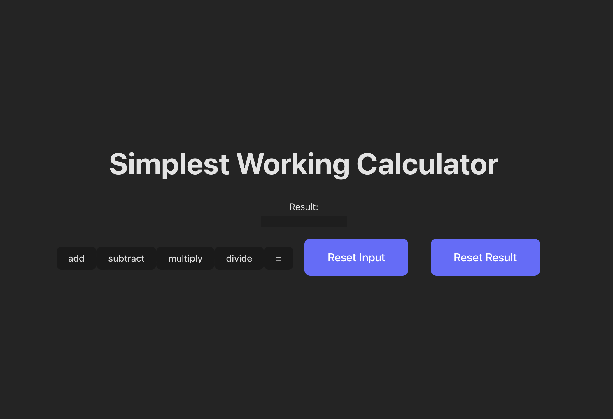

# Calculator App
This repository contains the final lab project for the course "React Basics" in Coursera.


## To run the Calculator App:
<ol>
<li>Clone or download the repository to your local machine.
<li>Ensure you have Node.js and npm installed on your machine.
<li>Navigate to the project directory in your terminal.
<li>Install the project dependencies by running:

```npm i```

<li>Once the dependencies are installed, you can start the development server by running:

```npm run dev```

<li>Open your web browser and navigate to http://localhost:3000 to view the Calculator App.
</ol>

Feel free to reach out if you encounter any issues or have further questions!

## Author
Karima TOUHAMI.